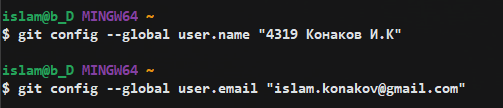
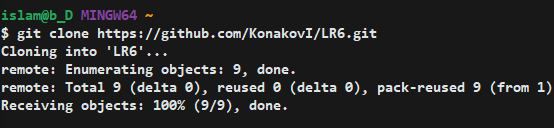
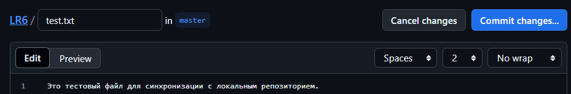

### ГУАП 
### КАФЕДРА №44 
## ПРЕПОДАВАТЕЛЬ: Ассистент Т.Р.Мустафин 
## ОТЧЕТ О ЛАБОРАТОРНОЙ РАБОТЕ №6
## СИСТЕМА КОНТРОЛЯ ВЕРСИЙ 
## По курсу: ОСНОВЫ ПРОГРАММИРОВАНИЯ 
## РАБОТУ ВЫПОЛНИЛ: СТУДЕНТ гр. № 4319 И.К.Конаков 
## Санкт-Петербург 2024 

**Цель лабораторной работы:** изучение базовых возможностей системы управления версиями, опыт работы с Git Api, опыт работы с локальным и удаленным репозиторием.

## Ход работы:
Ввод имени и email:

Клонирован свой личный удаленный репозиторий на компьютер:

Добавлен файл через интерфейс GitHub. Подтянуты изменения в локальный репозиторий:

[Рисунок 4 - подтянуты изменения из удаленного репозитория](screenshots/5.png)

Получены истории операций:
[Рисунок 5 - история операций](screenshots/6.png)

Просмотрены последние изменения:
[Рисунок 6 - последние изменения](screenshots/7.png)

Слияние в ветку master:
[Рисунок 7 - конфликт при сляинии](screenshots/8.png)

Удаление ветки после успешного слияния:
[Рисунок 8 - удаление ветки после слияния](screenshots/9.png)

Сделаны изменения несколько раз и зафиксированы:
[Рисунок 9 - изменения файла 1](screenshots/13.png)
[Рисунок 10 - изменения файла 2](screenshots/14.png)

Откат коммита:
[Рисунок 11 - откат коммита](screenshots/15.png)

Создана ветка для отчета:
[Рисунок 12 - ветка для отчета](screenshots/16.png)

Начало оформления отчета:
[Рисунок 13 - начало работы над отчетом](screenshots/17.png)

